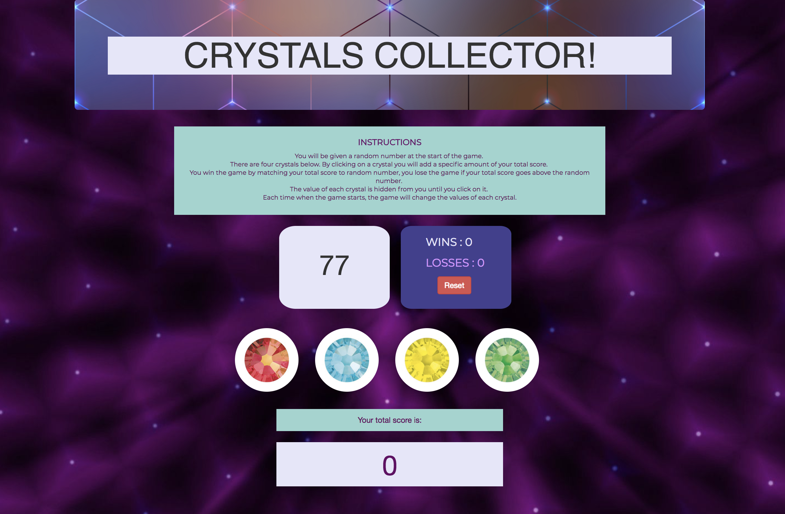

# Week-4-game

##Overview

*Crystals Collector is a game where the computer choses a number and by clicking the crystals user will be adding to the total and by guessing the number the computer had chosen the user WINS! 

## Technologies implemented

*HTML, CSS, Bootstrap, Javascript.

## Author

**Reyna Perez**

## Acknowledgments

*UA Programing Bootcamp